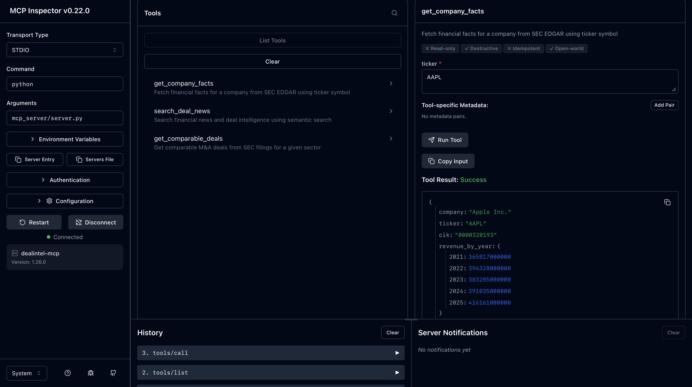

# 💼 DealIntel — AI-Powered M&A Analysis Platform

## Live Demo

🔗 **[dealintel-qzyy7g4jmeuvkjvmev5pfc.streamlit.app](https://dealintel-qzyy7g4jmeuvkjvmev5pfc.streamlit.app)**
> Demo Mode is on by default for instant, reliable results. Toggle it off in the sidebar to run live AI analysis on any company pair (subject to free-tier API rate limits).

DealIntel automates the work of an investment banking analyst — fetching real financial data, calculating valuations, assessing deal risk, and writing a full Investment Memorandum — using a multi-agent AI system built on **CrewAI** and the **Model Context Protocol (MCP)**.

> Built as a portfolio project to demonstrate practical, architecturally-correct use of MCP — not just as a buzzword, but as the actual data layer powering autonomous AI agents.

---

## What it does

Given two company tickers (an acquirer and a target) and a deal premium, DealIntel:

1. Fetches real financial data from SEC EDGAR (revenue, net income, assets)
2. Pulls comparable M&A deals from a semantic search index (Pinecone)
3. Runs a DCF valuation and comparable transactions analysis
4. Identifies key deal risks, regulatory concerns, and synergies
5. Generates a professional Investment Memorandum (BUY/PASS recommendation)
6. Exports a full Excel deal model with DCF, sensitivity tables, and a football field chart

---

## Why MCP

This project's core architectural decision: **all external data-fetching is implemented as MCP tools**, not as ad-hoc API calls scattered across the codebase.
CrewAI Agent  --calls-->  MCP Server (dealintel-mcp)  --fetches-->  SEC EDGAR / Pinecone

- `mcp_server/server.py` defines 3 tools — `get_company_facts`, `search_deal_news`, `get_comparable_deals` — exposed over the standard MCP protocol (stdio transport)
- These same tool functions are imported directly by the CrewAI pipeline (`agents/crew.py`), so there is **one single source of truth** for how data is fetched
- The MCP server can be run standalone and inspected with the official [MCP Inspector](https://github.com/modelcontextprotocol/inspector) — verifying it's a real, protocol-compliant server independent of any specific AI framework

**Why this matters architecturally:** if the data source changes (e.g. swap SEC EDGAR for a paid data provider, or Pinecone for another vector DB), only the MCP tool implementation changes — the agents and the protocol contract stay the same.

---

## Tech Stack

| Layer | Technology |
|---|---|
| Agent orchestration | CrewAI |
| Tool/data layer | Model Context Protocol (MCP) |
| LLM | Groq (Llama 3.3 70B) |
| Vector search / RAG | Pinecone |
| Financial data | SEC EDGAR (public API) |
| Excel generation | openpyxl |
| Dashboard | Streamlit + Plotly |

---

## Architecture
dealintel/

├── mcp_server/

│   └── server.py          # MCP server — 3 tools, stdio transport

├── agents/

│   ├── crew.py             # CrewAI pipeline — imports MCP tool functions directly

│   ├── deal_agents.py       # Agent definitions

│   └── excel_exporter.py    # DCF + sensitivity + football field Excel export

├── frontend/

│   └── app.py               # Streamlit dashboard

└── docs/

└── MCP_ARCHITECTURE.md  # Deeper dive into the MCP design decision

---

## Running it locally

```bash
# 1. Clone and set up environment
git clone https://github.com/rahulmandal21/dealintel.git
cd dealintel
python3 -m venv venv
source venv/bin/activate
pip install -r requirements.txt

# 2. Add your API keys to .env
GROQ_API_KEY=your_key
PINECONE_API_KEY=your_key
PINECONE_INDEX=dealintel

# 3. Run the dashboard
streamlit run frontend/app.py
```

### Inspecting the MCP server independently

```bash
npx @modelcontextprotocol/inspector python mcp_server/server.py
```

This opens a browser UI where you can call each tool directly and verify real SEC EDGAR data comes back — completely independent of the CrewAI pipeline.

---

## Example output

Given `AMZN` acquiring `NFLX` at a 25% premium, DealIntel generates a full Investment Memorandum including:

- DCF valuation range (WACC 10%, terminal growth 3%)
- Comparable transactions analysis (sector EV/EBITDA multiples)
- Football field valuation summary
- Top 5 deal risks with regulatory risk scoring
- Synergy analysis with estimated dollar values
- A clear BUY/PASS recommendation

Plus a downloadable Excel workbook with a live DCF model, sensitivity table, and chart.

---

## Disclaimer

This project uses only publicly available data (SEC EDGAR filings, public financial news) for educational and portfolio purposes. It is not financial advice and is not intended for real investment decision-making.

---


## Proof: MCP Server Verified Independently

The screenshot below shows the MCP server running standalone, connected to the official [MCP Inspector](https://github.com/modelcontextprotocol/inspector) (a generic MCP client, unrelated to CrewAI). The `get_company_facts` tool was called directly with `ticker: AAPL` and returned real financial data live from SEC EDGAR — confirming the server is a genuine, protocol-compliant MCP server, not just a wrapper used internally by the agents.



